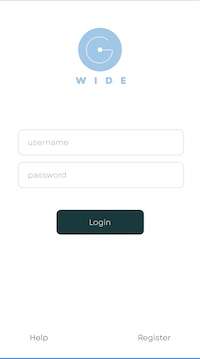

# GoWide - Travel Organization App

GoWide is a mobile application designed to streamline travel planning and coordination among friends. With GoWide, you can easily organize trips, manage itineraries, and stay connected with your travel companions.

## Screenshots



*Login Screen*


*User Profile Screen*

## Features

- **Login Screen**: Users can authenticate using their credentials stored in WordsData.ks.
- **User Profile Screen**: Users can view and edit their personal information, including name, email, and profile picture.

## Installation

To install GoWide on your device, follow these steps:

1. Clone this repository to your local machine:
   ```bash
   git clone https://github.com/yourusername/gowide.git
